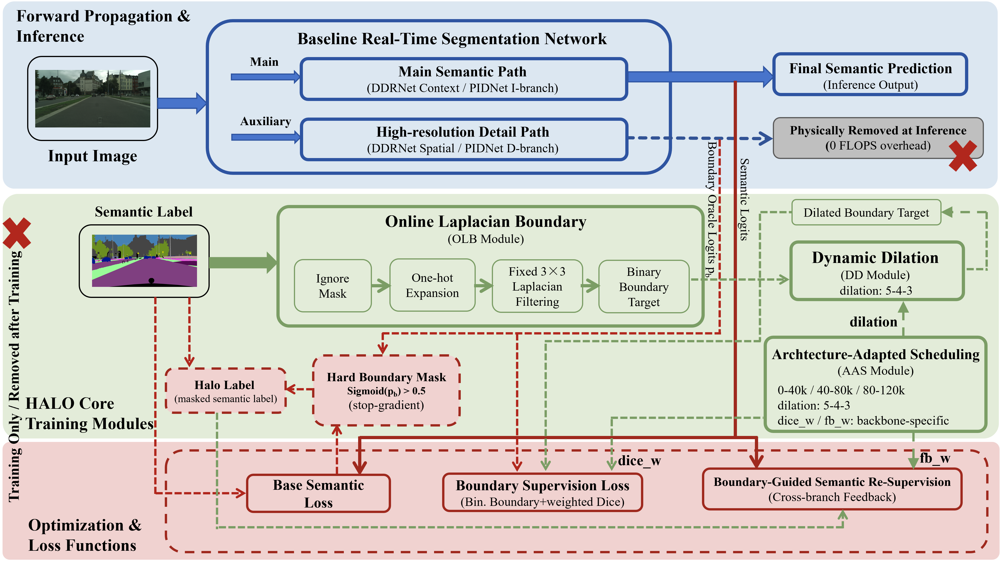
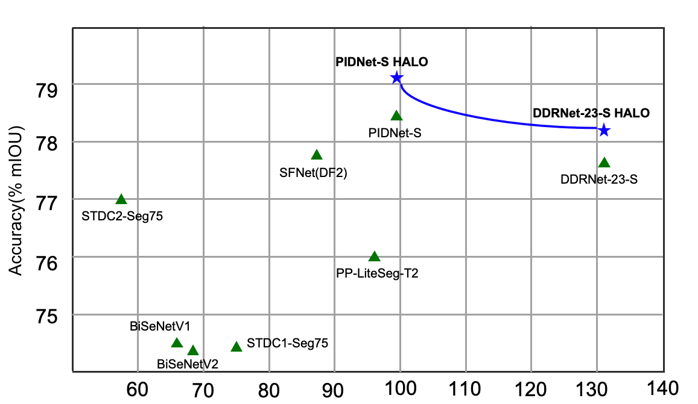
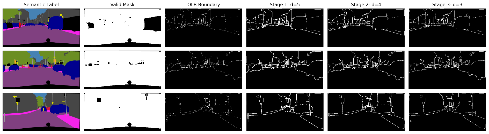
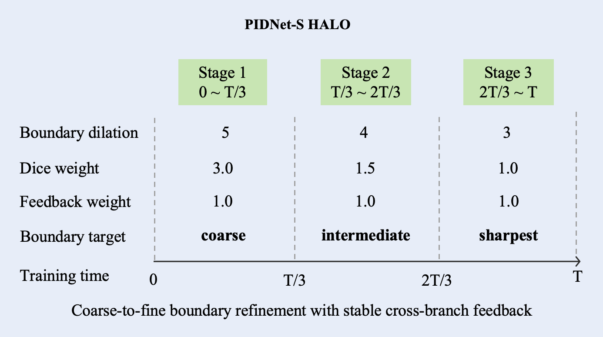
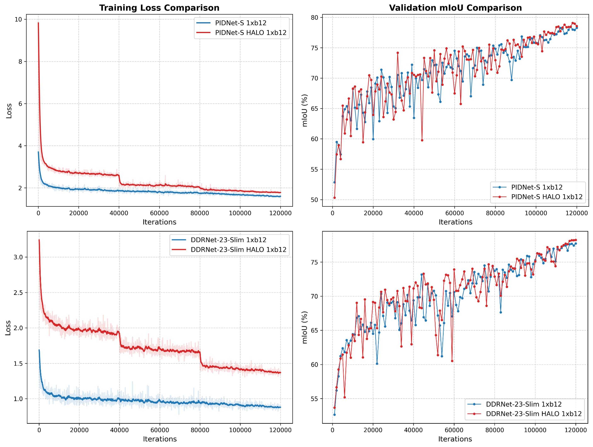
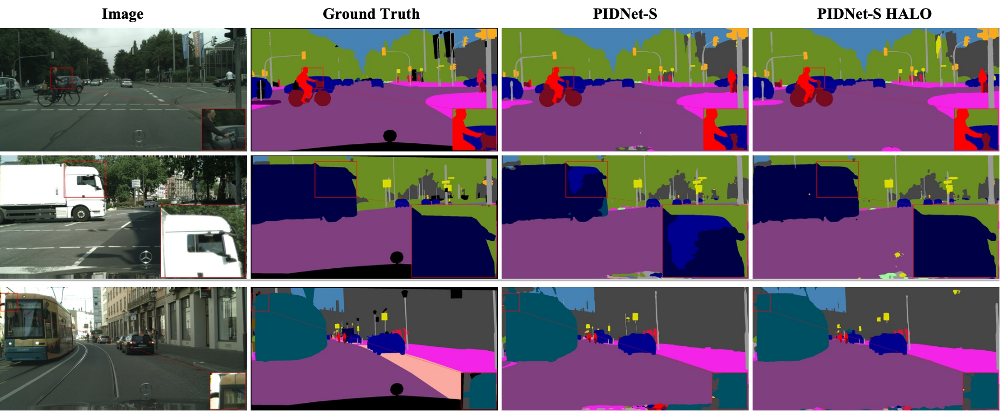

[English](#english) | [简体中文](#简体中文)

<a id="english"></a>
# Architecture-Adapted Online Boundary Supervision for Real-Time Semantic Segmentation

>  A training-only boundary supervision framework that improves real-time semantic segmentation without adding any inference-time parameters or FLOPs.

<p align="center">
  
  <br>
  <b>Figure 2. Overview of the proposed HALO framework. HALO performs online boundary generation, coarse-to-fine dynamic dilation, and architecture-aware supervision scheduling during training. All extra components are discarded in inference, introducing no overhead.</b>
</p>

# Introduction
<p align="center">
  
  <br>
  <b>Figure 1. Accuracy-efficiency trade-off on Cityscapes. HALO shifts lightweight real-time backbones to a better accuracy-efficiency region without changing the deployed inference cost. FPS values of prior methods are shown for reference only.</b>
</p>

<p align="center">
  
  <br>
  <b>Figure 5. Validation mIoU curves during training on Cityscapes under the same single-GPU setting. HALO converges to consistently higher final mIoU than the reproduced baselines on both DDRNet-23-slim and PIDNet-S.</b>
</p>

<p align="center">
  
  <br>
  <b>Figure 4. Architecture-aware scheduling in HALO. With milestones at T/3 and 2T/3, the boundary dilation is scheduled as 5→4→3, the Dice-loss weight is reduced as 3.0→1.5→1.0, and the feedback weight remains fixed at 1.0. This decoupled design enables coarse-to-fine boundary refinement with stable cross-branch feedback.</b>
</p>

<p align="center">
  
  <br>
  <b>Figure 5. Validation mIoU curves during training on Cityscapes under the same single-GPU setting. HALO converges to consistently higher final mIoU than the reproduced baselines on both DDRNet-23-slim and PIDNet-S.</b>
</p>

<p align="center">
  
  <br>
  <b>Figure 6. Qualitative comparison of segmentation results on the Cityscapes dataset. From left to right: input image, ground truth, baseline PIDNet-S prediction, and our HALO prediction. Red boxes highlight fine-grained boundary regions.</b>
</p>

## Highlights

- **Online Laplacian Boundary (OLB):** Generates class-wise boundary targets directly from semantic labels with no precomputation and no learnable parameters.
- **Dynamic Dilation:** Progressively reshapes boundary targets from coarse to fine following a curriculum learning schedule (5 → 4 → 3).
- **Architecture-Adapted Scheduling (AAS):** Decouples boundary supervision from cross-branch semantic feedback and adapts supervision strength to each backbone.
- **Zero inference overhead:** All HALO modules are disabled at inference. FPS, parameters, and FLOPs remain identical to the baseline.
- **Code mapping (current repo):** Main HALO training configs are in `configs/haloseg/`; core implementations are in `mmseg/models/decode_heads/ddr_head_halo_avg3_opt_fb_fix05.py` and `mmseg/models/decode_heads/pid_head_halo_ddr_avg3_opt.py`.

---

## Results

### Cityscapes

| Model                  | mIoU (%) | Boundary IoU (%) | FPS   | Params |
|------------------------|----------|------------------|-------|--------|
| PIDNet-S               | 78.4     | 73.5             | 99.8  | 7.7M   |
| PIDNet-S + HALO        | **79.1** | **74.2**         | 99.8  | 7.7M   |
| DDRNet-23-slim         | 77.7     | 72.6             | 130.6 | 5.7M   |
| DDRNet-23-slim + HALO  | **78.2** | **73.2**         | 130.6 | 5.7M   |

### CamVid (Cityscapes → CamVid fine-tuning)

| Model                  | mIoU (%) | FPS   |
|------------------------|----------|-------|
| PIDNet-S               | 79.8     | 144.8 |
| PIDNet-S + HALO        | **80.7** | 144.8 |
| DDRNet-23-slim         | 79.3     | 204.4 |
| DDRNet-23-slim + HALO  | **79.7** | 204.4 |

All results are measured on a single NVIDIA RTX 3090 under the same single-GPU setting. FPS is averaged over 50 runs after 20 warm-ups.

---

## Installation

```bash
conda create -n halo python=3.8 -y
conda activate halo

# PyTorch (tested with 2.2.1 + CUDA 11.8)
pip install torch==2.2.1 torchvision==0.17.1 --index-url https://download.pytorch.org/whl/cu118

# MMSegmentation
pip install -U openmim
mim install mmengine
mim install "mmseg==1.2.2"

# Clone and install
git clone https://github.com/YOUR_USERNAME/HALO-Seg.git
cd HALO-Seg
pip install -e .
```

---

## Dataset Preparation

### Cityscapes

Download Cityscapes from the [official website](https://www.cityscapes-dataset.com/) and organize as follows:

```text
data/
└── cityscapes/
    ├── leftImg8bit/
    │   ├── train/
    │   └── val/
    └── gtFine/
        ├── train/
        └── val/
```

Then run the MMSegmentation preprocessing script:

```bash
python tools/dataset_converters/cityscapes.py data/cityscapes
```

### CamVid

Download CamVid following the [MMSegmentation guide](https://mmsegmentation.readthedocs.io/) and organize as follows:

```text
data/
└── CamVid/
    ├── train/
    ├── train_labels/
    ├── val/
    ├── val_labels/
    ├── test/
    └── test_labels/
```

---

## Training

### Cityscapes — PIDNet-S + HALO

```bash
bash tools/dist_train.sh \
  configs/haloseg/pidnet-s_1xb12-120k_1024x1024-cityscapes-halo.py \
  1
```

### Cityscapes — DDRNet-23-slim + HALO

```bash
bash tools/dist_train.sh \
  configs/haloseg/ddrnet_23-slim_in1k-pre_1xb12-120k_cityscapes-1024x1024_halo.py \
  1
```

### CamVid fine-tuning — PIDNet-S + HALO

```bash
bash tools/dist_train.sh \
  configs/haloseg/pidnet-s_camvid_halo.py \
  1
```

### CamVid fine-tuning — DDRNet-23-slim + HALO

```bash
bash tools/dist_train.sh \
  configs/haloseg/ddrnet-23-slim_camvid_halo.py \
  1
```

All main experiments are conducted on a single RTX 3090 with batch size 12. Training PIDNet-S takes approximately 16 hours and 13.5 GB of GPU memory.

---

## Evaluation

```bash
# Evaluate on Cityscapes val set
bash tools/dist_test.sh \
  configs/haloseg/pidnet-s_1xb12-120k_1024x1024-cityscapes-halo.py \
    checkpoints/halo_pidnet-s_cityscapes.pth \
    1

# Evaluate per-class Boundary IoU (Baseline vs HALO)
python configs/haloseg/boundary_iou_per_class.py
```

---

## Project Structure

```text
HALO-Seg/
├── configs/
│   └── haloseg/
│       ├── pidnet-s_1xb12-120k_1024x1024-cityscapes-halo.py
│       ├── ddrnet_23-slim_in1k-pre_1xb12-120k_cityscapes-1024x1024_halo.py
│       ├── pidnet-s_camvid_halo.py
│       ├── ddrnet-23-slim_camvid_halo.py
│       └── boundary_iou_per_class.py
├── mmseg/
│   ├── models/
│   │   └── decode_heads/
│   │       ├── ddr_head_halo_avg3_opt_fb_fix05.py
│   │       └── pid_head_halo_ddr_avg3_opt.py
├── tools/
├── data/
├── checkpoints/
└── README.md
```

## Core Implementation Files

- `configs/haloseg/*`: all HALO experiment configs (Cityscapes + CamVid, base + HALO).
- `mmseg/models/decode_heads/ddr_head_halo_avg3_opt_fb_fix05.py`: DDRNet HALO head (`DDRHeadHALOAvg3OptFbFix05`).
- `mmseg/models/decode_heads/pid_head_halo_ddr_avg3_opt.py`: PIDNet HALO head (`PIDHeadHALOSameDDRAvg3Opt`).
- `configs/haloseg/boundary_iou_per_class.py`: Boundary IoU comparison utility.

---

## Key Hyperparameters

| Hyperparameter          | PIDNet-S         | DDRNet-23-slim   |
|-------------------------|------------------|------------------|
| Dilation schedule       | 5 → 4 → 3        | 5 → 4 → 3        |
| Dice weight schedule    | 3.0 → 1.5 → 1.0  | 1.0 → 0.5 → 0.1  |
| Feedback weight wfb     | 1.0              | 0.5              |
| Boundary threshold τ    | 0.1              | 0.1              |
| Boundary mask threshold | 0.5              | 0.5              |
| Total iterations        | 120k             | 120k             |
| Crop size               | 1024×1024        | 1024×1024        |
| Batch size              | 12               | 12               |
| Random seed             | 304              | 304              |

---

## Pretrained Weights

| Model                 | Dataset    | mIoU | Download |
|-----------------------|------------|------|----------|
| PIDNet-S + HALO       | Cityscapes | 79.1 | [link]() |
| DDRNet-23-slim + HALO | Cityscapes | 78.2 | [link]() |
| PIDNet-S + HALO       | CamVid     | 80.7 | [link]() |
| DDRNet-23-slim + HALO | CamVid     | 79.7 | [link]() |

Pretrained weights will be released upon paper acceptance.

---

## Citation

If you find this work useful, please consider citing:

```bibtex
@article{halo2025,
  title   = {HALO: Architecture-Adapted Online Boundary Supervision for Real-Time Semantic Segmentation},
  author  = {},
  journal = {},
  year    = {2025}
}
```

---

## Acknowledgements

This project is built upon [MMSegmentation](https://github.com/open-mmlab/mmsegmentation), [PIDNet](https://github.com/XuJiacong/PIDNet), and [DDRNet](https://github.com/ydhongHIT/DDRNet). We thank the authors for their excellent work.

---

## License

This project is released under the [Apache 2.0 License](LICENSE).

<br>
<br>

<a id="简体中文"></a>
# 简体中文

# 面向实时语义分割的架构自适应在线边界监督框架

> **摘要:** 一种纯训练阶段的边界监督框架，在不增加任何推理期参数或计算量（FLOPs）的情况下提升实时语义分割的性能。

---

## 核心亮点

- **在线拉普拉斯边界 (OLB):** 直接从语义标签生成类感知边界目标，无需预计算，无任何可学习参数。
- **动态膨胀 (Dynamic Dilation):** 遵循课程学习策略（5 → 4 → 3），将边界目标由粗到细进行渐进式重塑。
- **架构自适应调度 (AAS):** 将边界监督与跨分支语义反馈解耦，并针对不同的骨干网络自适应调整监督强度。
- **零推理开销:** 所有 HALO 模块在推理阶段均被禁用。模型的 FPS、参数量和 FLOPs 与基线模型完全一致。

---

## 实验结果

### Cityscapes 数据集

| 模型                   | mIoU (%) | Boundary IoU (%) | FPS   | 参数量 |
|------------------------|----------|------------------|-------|--------|
| PIDNet-S               | 78.4     | 73.5             | 99.8  | 7.7M   |
| PIDNet-S + HALO        | **79.1** | **74.2**         | 99.8  | 7.7M   |
| DDRNet-23-slim         | 77.7     | 72.6             | 130.6 | 5.7M   |
| DDRNet-23-slim + HALO  | **78.2** | **73.2**         | 130.6 | 5.7M   |

### CamVid 数据集 (从 Cityscapes 微调)

| 模型                   | mIoU (%) | FPS   |
|------------------------|----------|-------|
| PIDNet-S               | 79.8     | 144.8 |
| PIDNet-S + HALO        | **80.7** | 144.8 |
| DDRNet-23-slim         | 79.3     | 204.4 |
| DDRNet-23-slim + HALO  | **79.7** | 204.4 |

所有结果均在相同的单卡配置下（单张 NVIDIA RTX 3090）测得。FPS 取 20 次预热后的 50 次平均值。

---

## 环境安装

```bash
conda create -n halo python=3.8 -y
conda activate halo

# 安装 PyTorch (测试环境为 2.2.1 + CUDA 11.8)
pip install torch==2.2.1 torchvision==0.17.1 --index-url https://download.pytorch.org/whl/cu118

# 安装 MMSegmentation
pip install -U openmim
mim install mmengine
mim install "mmseg==1.2.2"

# 克隆并安装本项目
git clone https://github.com/YOUR_USERNAME/HALO-Seg.git
cd HALO-Seg
pip install -e .
```

---

## 数据准备

### Cityscapes

从 [官方网站](https://www.cityscapes-dataset.com/) 下载 Cityscapes 数据集，并按如下结构组织文件：

```text
data/
└── cityscapes/
    ├── leftImg8bit/
    │   ├── train/
    │   └── val/
    └── gtFine/
        ├── train/
        └── val/
```

运行 MMSegmentation 提供的预处理脚本：

```bash
python tools/dataset_converters/cityscapes.py data/cityscapes
```

### CamVid

参考 [MMSegmentation 官方指南](https://mmsegmentation.readthedocs.io/) 下载 CamVid 数据集，并按如下结构组织文件：

```text
data/
└── CamVid/
    ├── train/
    ├── train_labels/
    ├── val/
    ├── val_labels/
    ├── test/
    └── test_labels/
```

---

## 模型训练

### Cityscapes — PIDNet-S + HALO

```bash
bash tools/dist_train.sh \
  configs/haloseg/pidnet-s_1xb12-120k_1024x1024-cityscapes-halo.py \
  1
```

### Cityscapes — DDRNet-23-slim + HALO

```bash
bash tools/dist_train.sh \
  configs/haloseg/ddrnet_23-slim_in1k-pre_1xb12-120k_cityscapes-1024x1024_halo.py \
  1
```

### CamVid 微调 — PIDNet-S + HALO

```bash
bash tools/dist_train.sh \
  configs/haloseg/pidnet-s_camvid_halo.py \
  1
```

### CamVid 微调 — DDRNet-23-slim + HALO

```bash
bash tools/dist_train.sh \
  configs/haloseg/ddrnet-23-slim_camvid_halo.py \
  1
```

所有主实验均在单张 RTX 3090（Batch size 12）上进行。PIDNet-S 的训练时间约为 16 小时，显存占用约 13.5 GB。

---

## 模型评估

```bash
# 在 Cityscapes 验证集上评估
bash tools/dist_test.sh \
  configs/haloseg/pidnet-s_1xb12-120k_1024x1024-cityscapes-halo.py \
    checkpoints/halo_pidnet-s_cityscapes.pth \
    1

# 评估 Boundary IoU（Baseline vs HALO 逐类别对比）
python configs/haloseg/boundary_iou_per_class.py
```

---

## 项目结构

```text
HALO-Seg/
├── configs/
│   └── haloseg/
│       ├── pidnet-s_1xb12-120k_1024x1024-cityscapes-halo.py
│       ├── ddrnet_23-slim_in1k-pre_1xb12-120k_cityscapes-1024x1024_halo.py
│       ├── pidnet-s_camvid_halo.py
│       ├── ddrnet-23-slim_camvid_halo.py
│       └── boundary_iou_per_class.py
├── mmseg/
│   ├── models/
│   │   └── decode_heads/
│   │       ├── ddr_head_halo_avg3_opt_fb_fix05.py
│   │       └── pid_head_halo_ddr_avg3_opt.py
├── tools/
├── data/
├── checkpoints/
└── README.md
```

## 代码结构对应说明

- `configs/haloseg/*`：HALO 相关训练配置（Cityscapes + CamVid，base + halo）。
- `mmseg/models/decode_heads/ddr_head_halo_avg3_opt_fb_fix05.py`：DDRNet 的 HALO 解码头实现（`DDRHeadHALOAvg3OptFbFix05`）。
- `mmseg/models/decode_heads/pid_head_halo_ddr_avg3_opt.py`：PIDNet 的 HALO 解码头实现（`PIDHeadHALOSameDDRAvg3Opt`）。
- `configs/haloseg/boundary_iou_per_class.py`：Boundary IoU 对比评估脚本。

---

## 关键超参数

| 超参数                  | PIDNet-S         | DDRNet-23-slim   |
|-------------------------|------------------|------------------|
| 膨胀调度 (Dilation)     | 5 → 4 → 3        | 5 → 4 → 3        |
| Dice 权重调度           | 3.0 → 1.5 → 1.0  | 1.0 → 0.5 → 0.1  |
| 反馈权重 wfb            | 1.0              | 0.5              |
| 边界阈值 τ              | 0.1              | 0.1              |
| 边界掩码阈值            | 0.5              | 0.5              |
| 总迭代次数              | 120k             | 120k             |
| 裁剪尺寸 (Crop size)    | 1024×1024        | 1024×1024        |
| Batch size              | 12               | 12               |
| 随机种子                | 304              | 304              |

---

## 预训练权重

| 模型                   | 数据集     | mIoU | 下载链接 |
|------------------------|------------|------|----------|
| PIDNet-S + HALO        | Cityscapes | 79.1 | [link]() |
| DDRNet-23-slim + HALO  | Cityscapes | 78.2 | [link]() |
| PIDNet-S + HALO        | CamVid     | 80.7 | [link]() |
| DDRNet-23-slim + HALO  | CamVid     | 79.7 | [link]() |

预训练权重将在论文被接收后发布。

---

## 引用

如果您认为此项目对您的研究有帮助，请考虑引用：

```bibtex
@article{halo2025,
  title   = {HALO: Architecture-Adapted Online Boundary Supervision for Real-Time Semantic Segmentation},
  author  = {},
  journal = {},
  year    = {2025}
}
```

---

## 致谢

本项目基于 [MMSegmentation](https://github.com/open-mmlab/mmsegmentation)、[PIDNet](https://github.com/XuJiacong/PIDNet) 以及 [DDRNet](https://github.com/ydhongHIT/DDRNet) 构建。感谢原作者们的开源贡献。

---

## 许可证

本项目基于 [Apache 2.0 许可证](LICENSE) 开源。
```